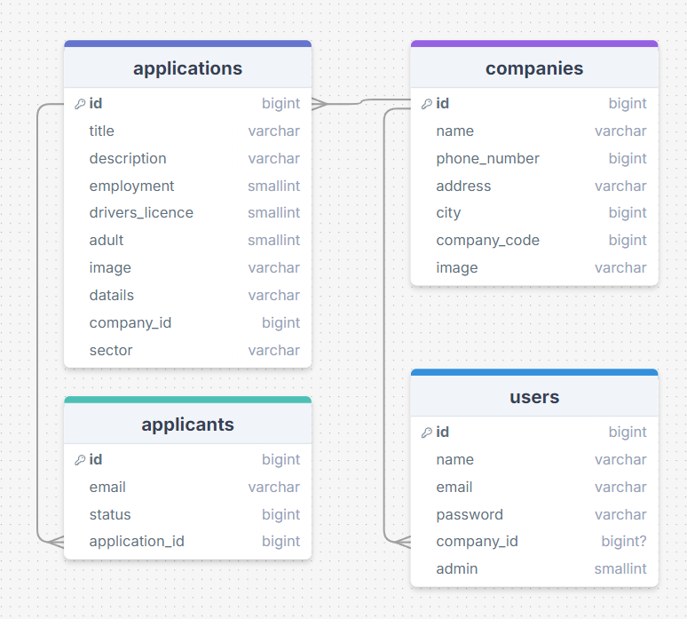

# Open Hiring Technisch overdrachtsdocument.

##Changelog 21/1
TODO
email setup aanpassen
translate page naar engels


## Introductie

Welkom bij het "Open Hiring" project. 
Deze documentatie bevat een technische overdracht van het project. 
Hierin staat waar je wat kunt vinden binnen het project en hoe de database werkt.


### Setup
Dit project maakt gebruik van Laravel. Ook hangt het project af van Breeze en Composer.

Volg de volgende installatie om Composer te installeren in uw besturingssysteem.
[Composer Documentatie](https://getcomposer.org/doc/00-intro.md)

Voer de volgende commando uit in de terminal van je IDE om composer te installeren in het systeem
``composer install``

Deze commando moet uitgevoerd worden om breeze te installeren.
```bash
composer require laravel/breeze --dev
```

De volgende commando's moeten uitgevoerd worden binnen de IDE om een .env bestand aan te maken deze wordt gebruikt voor configuratie.:
``cp .env.example .env``
``php artisan key:generate``

Voer de volgende commando uit om de databases aan te maken:
``php artisan migrate``

Werk in het .env bestand de DB configuraties bij met de juiste database gegevens, zet 'DB_CONNECTION' als 'sqlite'.


### Mailsysteem setup
Dit project maakt ook gebruik van de composer library "phpmailer" om mails te kunnen versturen.
Deze kan geïstalleerd worden door middel van dit commando:

```bash
composer require phpmailer/phpmailer
```

### Lokale development 
Om de website lokaal te testen moet je gebruik maken van de volgende commando's, 
deze moeten worden uitgevoerd in de terminal van de IDE:

```bash
npm run dev
```
En deze moet in een aparte terminal van de IDE uitgevoerd worden:
```bash
php artisan serve
```


Je hebt nu een werkend project in je lokale omgeving.

## Projectstructuur

De project repository is als volgt gestructureerd:

- /app: Bevat de kernlogica van de Laravel-applicatie, zoals controllers, modellen en services.

- /bootstrap: Startbestanden voor het opzetten van de applicatie.

- /config: Configuratiebestanden voor de applicatie.

- /database: Migratie- en seeding-bestanden voor het beheren van de database.

- /public: Bevat de index.php en andere openbare bestanden (zoals afbeeldingen, CSS, JavaScript).

- /resources: Views die we hebben onderverdeeld in sub groepen zoals admin, emails en application
  - css: Stijlsheets voor de applicatie.
  - js: JavaScript-bestanden voor de front-end functionaliteit.
  - views: De Blade-views (Laravel's templating engine) zijn hier opgeslagen. Deze map is verder onderverdeeld:
  - admin: Views die specifiek zijn voor de admin pagina's
  - application: Views die specifiek zijn voor het sollicitatieproces.
  - auth: Bevat views voor authenticatie, zoals login en registratie.
  - companies: Bevat de views die gerelateerd zijn aan bedrijven (bijv. bedrijfsprofielen).
  - components: Kleine, herbruikbare componenten zoals modals of formulieren.
  - emails: Bevat de views voor e-mails die naar gebruikers worden gestuurd.
  - layouts: Overkoepelende layouts (zoals een master blade template) die andere views gebruiken.
  - profile: Views die gerelateerd zijn aan gebruikersprofielen.
    <br><br>
  - about-us.blade.php: Pagina met informatie over het bedrijf of team.
  - companies.blade.php: Pagina met een overzicht van bedrijven.
  - dashboard.blade.php: Dashboardpagina met een overzicht voor de gebruiker.
  - error.blade.php: Foutpagina voor wanneer iets misgaat.
  - home.blade.php: Startpagina voor de applicatie.
  - vacature-overzicht.blade.php: Pagina met een overzicht van vacatures.


- /routes: Bevat de routebestanden (bijvoorbeeld web.php voor webroutes).

- /storage: Bestanden, hier worden de foto's bijvoorbeeld opgeslagen.

- /tests: Bevat unit- en integratietests.

- /vendor: Bevat afhankelijkheden die via Composer zijn geïnstalleerd.

<br>
 
- .env: In dit bestand staan de configuraties voor dit project. Deze moet handmatig aangemaakt worden en wordt niet meegeleverd vanwege veiligheidsredenen. (

- composer.json: Bevat de afhankelijkheden en metadata van het project.

- package.json: Voor front-end afhankelijkheden en scripts.

## Database Uitleg

De database is ontworpen om de kernfunctionaliteiten van de applicatie te ondersteunen. Hieronder een overzicht van de tabellen en hun functies:


### Users:
- Beschrijft managers en admins van de applicatie.
- Velden:
  - id: Unieke ID van de gebruiker.
  - name: Naam van de gebruiker.
  - email: E-mailadres van de gebruiker (uniek).
  - email_verified_at: Datum en tijd van e-mailverificatie.
  - password: Gehasht wachtwoord.
  - remember_token: Token voor sessies.
  - created_at: Aanmaakdatum.
  - updated_at: Laatste wijzigingsdatum.
  - company_id: ID van het bedrijf waartoe de gebruiker behoort.
  - admin: Boolean (0/1) 1 voor adminrechten.

### Companies:
- Bevat informatie over bedrijven die vacatures plaatsen.
- Velden:
  - id: Unieke ID van het bedrijf.
  - name: Naam van het bedrijf.
  - phone_number: Telefoonnummer van het bedrijf.
  - address: Adres van het bedrijf.
  - city: Stad waar het bedrijf gevestigd is.
  - company_code: Unieke code om aan te kunnen melden bij een bedrijf.
  - created_at: Aanmaakdatum.
  - updated_at: Laatste wijzigingsdatum.
  - image: Bedrijfsafbeelding.

### Applications:
- Houdt vacatures bij die bedrijven hebben geplaatst.
- Velden:
  - id: Unieke ID van de vacatures.
  - creation_date: Datum van creatie.
  - title: Titel van de vacature (functie in het bedrijf).
  - description: Beschrijving van de vacature (De langere tekst die op het vacature overzicht zichtbaar is).
  - employment: Boolean (0/1) 1 voor Full time en 0 voor Part time.
  - drivers_licence: Boolean (0/1) voor rijbewijs vereiste, 1 voor verplicht.
  - adult: Boolean (0/1) voor meerderjarigheid, 1 voor verplicht.
  - image: Afbeelding van de baan.
  - details: Korte beschrijving van de vacature (De kortere tekst voor op de index pagina).
  - company_id: ID van het bedrijf dat de vacature plaatste.
  - created_at: Aanmaakdatum.
  - updated_at: Laatste wijzigingsdatum.
  - sector: Sector waarin de vacature valt.

### Applicants:
- Bevat informatie over sollicitanten.
- Velden:
  - id: Unieke ID van de sollicitant.
  - email: E-mailadres van de sollicitant.
  - status: Status van de sollicitatie (bijv. geaccepteerd, afgewezen).
  - application_id: ID van de vacature waarop is gesolliciteerd (foreign key).
  - created_at: Aanmaakdatum.
  - updated_at: Laatste wijzigingsdatum.

### Relaties:
- Users en Companies: Een manager kan gekoppeld zijn aan een bedrijf.
- Companies en Applications: Een bedrijf kan meerdere vacatures plaatsen.
- Applications en Applicants: Een vacature kan meerdere sollicitanten hebben.

### Database Foto:


# Server up to date houden:

Mochten er aanpassingen gedaan moeten worden aan de website, dan kun je deze instructies volgen om een nieuwe versie op de server te zetten.
1. Zorg er voor dat de nieuwe versie op de Main branch van de Github staat.
2. Maak een connectie door de Terminal/Powershell te openen.
3. Voer daar deze command in verbinding te maken:
```bash
ssh <inlognaam>@<IP-adres>
```
4. Geeft hierna je wachtwoord op.
5. Je hebt nu een verbinding gemaakt met de server.
6. Voer nu het volgende commando's uit om de nieuwe versie van de Github op de server te zetten.

Navigeer naar de correcte map
```bash
cd www/open-hiring
```
Voer het script uit om de nieuwe versies op de server te zetten.
```bash
./deploy.sh
```
Geef de correcte map aan.
```bash
open-hiring
```
7. Als er een nieuwe versie aanwezig is wordt deze op de server geïnstalleerd


